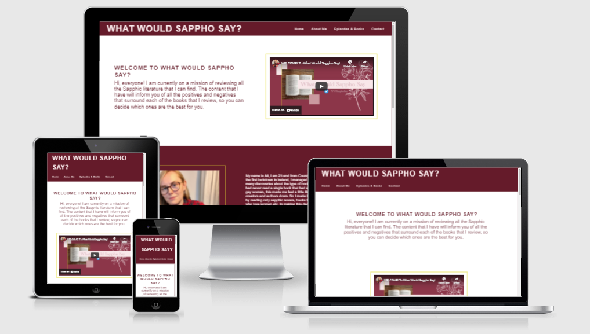
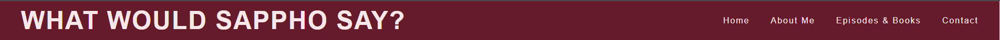
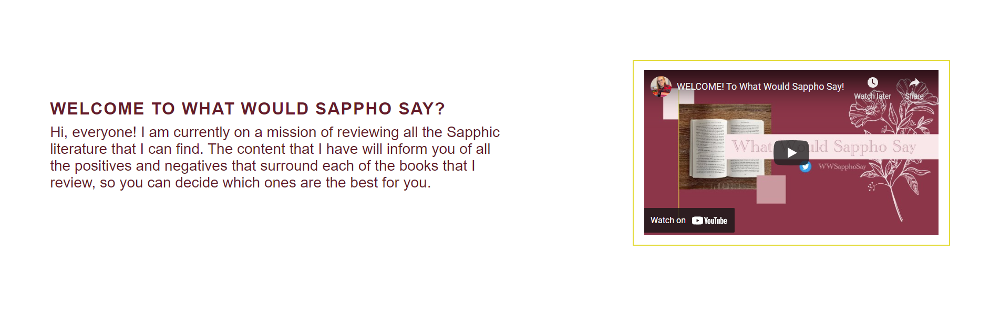
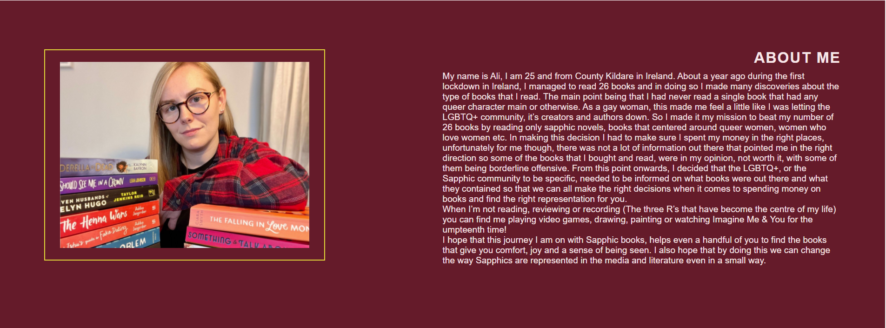
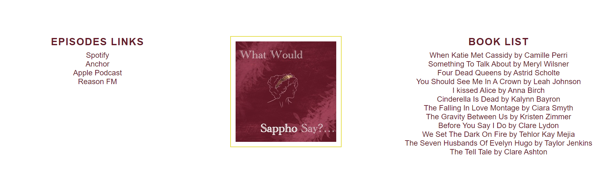
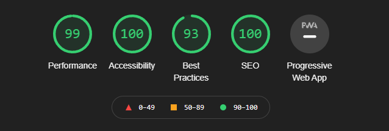

<h1>What Would Sappho Say?</h1>

The What Would Sappho Say? website is a landing page for listeners of the What Would Sappho Say? podcast. The What Would Sappho Say? podcast offers people in the LGBTQ+ community, who are interested in Sapphic literature, an in-depth review of Sapphic novels to help them make the right literary decisions.

The users of this website will be able to find all the information they need for the What Would Sappho Say? podcast: Introduction to the podcast, an About Me section of the host, Ali, links to all the platforms where the podcast can be listened to, a list of the books being reviewed in the current season, links to where to buy the books if they are interested, and a contact email as well as links to the official podcast's goodreads, twitter, and youtube pages. This site is targeted towards reading enthusiasts in the LGBTQ+ community interested in diving into the world of Sapphic literature.

<h2>Features</h2>

<ul>
    <li>
    <h3>Header and Navigation</h3>
    <ul>
    <li>Found at the top of the page is the navigation bar in the header. On the top left, the title of the site "WHAT WOULD SAPPHO SAY?" links to the top of the page</li>
    <li>On the top right, there are four other navigation links that link to different sections on the same page: Home, About Me, Episodes & Books, and Contact</li>
    <li>The font color pink and background color maroon of the header match the podcast colors and the font closely resembles that used by the client</li>
    <li>The navigation in the header lets the user know the name of the page and podcast and makes it easy to navigate to the sections they are looking for as the links are highlighted yellow and underlined when hovered over</li>
    </ul>
    
    <li>
    <h3>Home Section</h3>
    <ul>
    <li>The home section shows the name of the podcast and has a white background color to contrast with the font color that is the same maroon used for the background in the header</li>
    <li>The home section welcomes the user by introducing them to the purpose of the podcast</li>
    <li>This section also has an embedded introduction youtube video created by the client to introduce her content with a more indepth explanation</li>
    <li>This section provides the user with clear information about the podcast</li>
    </ul>
    
    </li>
    <li>
    <h3>About Me Section</h3>
    <ul>
    <li>The about me section has an image of the content creator, Ali, and a paragraph that explains her background and the reason for why she decided to start the podcast</li>
    <li>This section provides insight to the user about the motivations behind the content creator's decision and helps connect the audience to her in a more personal way, especially if they don't have the time or the ability to watch the intro video in the home section</li>
    <li>This section follows the same color scheme as the header and offers the site a more cohesive look as the background and font colors alternate through the sections</li>
    </ul>
    
    </li>
    <li>
    <h3>Episodes and Books Section</h3>
    <ul>
    <li>The episodes and books section offers the user direct links to all the platforms that they can currently use to listen to the podcast</li>
    <li>The icon for the podcast is placed in the center of this section as that is the icon the user will see when they are taken to the podcast's landing page of each streaming platform</li>
    <li>This section also has direct links to where the user can purchase the books that they're interested in that the content creator has reviewed or is currently reviewing</li>
    <li>The episodes and books section is important to the user as it helps them find the podcast episodes as well as makes it easy to find and purchase the books they want</li>
    </ul>
    
    </li>
    <li>
    <h3>Contact Section</h3>
    <ul>
    <li>The contact section offers four different ways for the user to connect with the content creator: email, Twitter, Goodreads, and Youtube</li>
    <li>Like in the navigation, the links highlight yellow when they are hovered over so the user knows that they can interact with the links</li>
    <li>This section is important to the user as it encourages them to reach out to the content creator and gives them options to connect if they so wish to</li>
    </ul>
    
    </li>
    </li>
</ul>
<h2>Testing</h2>

<ul>
<li>I tested that this page works in different browsers: Chrome, Firefox, Microsoft Edge, Safari</li>
<li>I confirmed that this project is responsive on different size standard screens by using the measurements listed in Am I responsive and by using the devtools</li>
<li>I have confirmed that every internal link works and that every external link opens in a new tab or in the appropiate application (mobile) and does not take the user out of the page</li>
</ul>

<h3>Bugs</h3>

<h4>Solved Bugs</h4>
<ul>
<li>When I checked the responsive design of my site with the media queries I had created on http://ami.responsivedesign.is/, I realized that not only was the site not responsive to the dimensions the Am I Responsive site uses but that additional space could be found at the right hand side of the page and the user could move the page side to side</li>
<li>I fixed the horizontal scroll by hidding the overflow in CSS by adding overflow-x: hidden; to the body element and the responsive issues by focusing on media queries that targeted the dimensions used by the Am I Responsive site instead of attempting to generalize the code</li>
</ul>

<h4>Validator Testing</h4>
<ul>
<li>HTML
    <ul>
    <li>One error was returned when passing through the official W3C validator the first time: <em>The frameborder attribute on the iframe element is obsolete. Use CSS instead.</em> This was part of the youtube code that was used to embed the intro youtube video. I fixed the issue by deleting the frameborder attribute from the code entirely</li>
    <li>No errors were returned when passing the code through the official W3C validator a second time</li>
    </ul>
</li>
<li>CSS
<ul>
    <li>No errors were found when passing through the official (Jigsaw) validator</li>
    </ul>
</li>
<li>Accessibility
<ul>
    <li>I confirmed that the colors and fonts chosen are easy to read and accessible by running it through lighthouse in devtools</li>
    
</ul>
</li>
</ul>
<h3>Unfixed Bugs</h3>

No unfixed bugs.

<h2>Deployment</h2>

<ul>
<li>The site was deployed to GitHub pages. The steps were as follows:
    <li>In the GitHub <a href= "https://github.com/LinaGarcia24/what-would-sappho-say-podcast">repository</a> navigate to the settings tab</li>
    <li>On the menu on left hand side, click on the second to last tab that reads "Pages"</li>
    <li>Once in Pages, in the dropdown menu in the Source section select the "main" branch and click save</li>
    <li>One the main branch is selected and saved, the link to the deployed website is provided</li>
</li>
</ul>

The live site can be found here: <a href= "https://linagarcia24.github.io/what-would-sappho-say-podcast">What Would Sappho Say?</a>

<h2>Credits</h2>

<h3>Content</h3>
<ul>
    <li>Guiding code for header, center icon, and footer was derived from the Love Running project.</li>
    <li>One line of code that helped hide the overflow on the x axis is from <a href= "https://www.w3schools.com/howto/howto_css_hide_scrollbars.asp">W3Schools.com</a></li>
    <li>Two lines of code that helped me eliminate the overflow on the x axis for mobile screens is from <a href= "https://stackoverflow.com/questions/15879710/disabling-horizontal-scroll-on-an-iphone-website">stackoverflow.com</a></li>
    <li>One line of code that helped me center the icon in the episode and books section is from <a href= "https://www.geeksforgeeks.org/how-to-float-three-div-side-by-side-using-css/">geeksforgeeks.org</a></li>
    <li>Code that helped me fit the Youtube video in a small mobile screen without ruining the aspect ratio came from <a href= "https://css-tricks.com/fluid-width-video/">css-tricks.com</a></li>
</ul>

<h3>Media</h3>
<ul>
    <li>Code for the embedded youtube video is from Youtube</li>
    <li>Photo of Ali and Icon came from Ali Lowry directly</li>
</ul>

<h3>Acknowledgements</h3>
<ul>
    <li>Thank you to my mentor, Victor Miclovich, for his help and teaching me how to smooth scroll the internal page navigation</li>
</ul>

